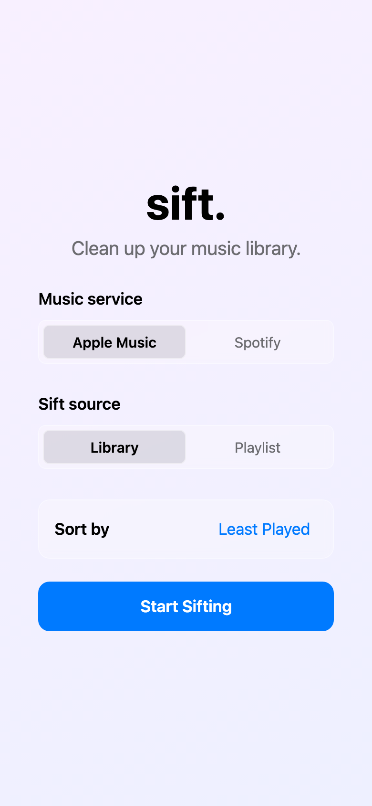
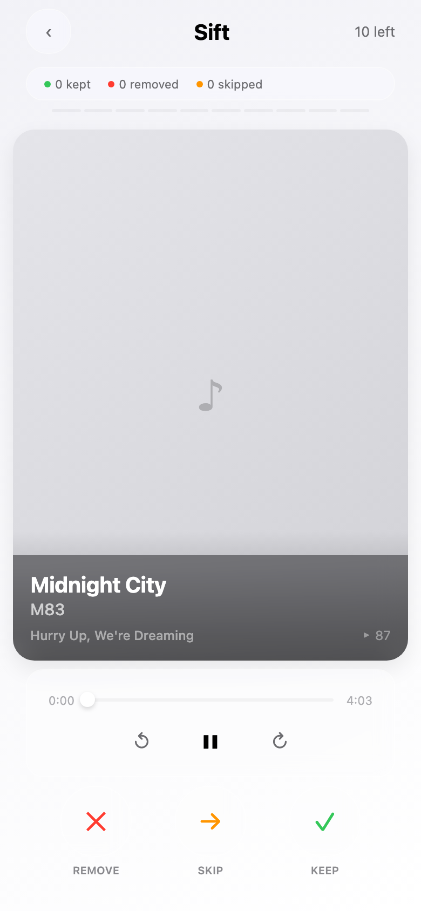
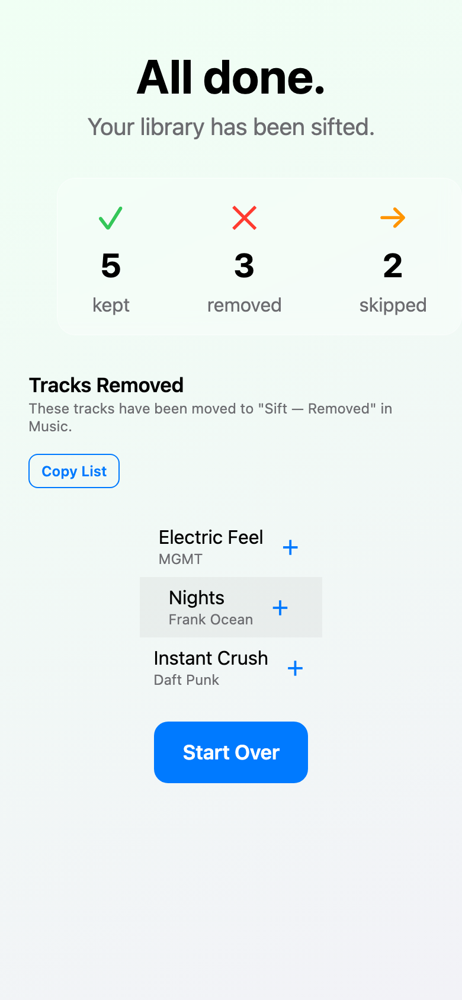

# Sift

**Tinder for your music library.** Swipe through every track you own and decide, in a second each: **Keep**, **Skip**, or **Remove** — with instant playback so you actually hear what you're culling. Works with **Apple Music** and **Spotify**.

Sift is a production-quality React Native (Expo) app built in TypeScript, with a hand-written Swift/MusicKit native module, gesture-driven animations, offline session persistence, and a full CI pipeline.

---

## Screenshots

| Setup | Sift (swipe) | Done |
|:---:|:---:|:---:|
|  |  |  |
| Pick a source & sort order | The card-swipe deck — the core loop | Session summary with restore & export |

> Rendered from the real app running on Expo Web with a local mock music provider (native Apple Music / Spotify auth is device-only).

---

## Highlights

- **Custom native Expo module (`modules/expo-musickit`)** — a hand-written Swift module bridging Apple's **MusicKit** into React Native via the Expo Modules API. It handles authorization, paginated library loading (500 tracks/page), in-app playback through `ApplicationMusicPlayer`, playlist read/create/edit, and on-device artwork resolution with a file cache. Because MusicKit can't delete library items, removals are gracefully rerouted into a `Sift — Removed` playlist the user can clear manually. See [`modules/expo-musickit/ios/ExpoMusicKitModule.swift`](modules/expo-musickit/ios/ExpoMusicKitModule.swift).
- **Two music backends behind one interface** — Apple Music (native) and Spotify (OAuth via `expo-auth-session` + 30s preview playback) both implement a single `MusicProviderService`. A factory swaps them at runtime and falls back to an in-memory mock when no native module is present (Expo Go, web, CI).
- **Gesture-driven swipe deck** — the card stack is built on `react-native-gesture-handler` + `react-native-reanimated` worklets, with drag rotation, spring-back, and threshold-based Keep/Remove overlays.
- **"Liquid glass" UI** — a reusable blur/material design system (`GlassCard`, `GlassBackground`) with centralized design tokens and automatic light/dark theming.
- **Crash-safe sessions** — all state lives in a single typed `useReducer`; sessions auto-save (debounced) to `AsyncStorage` after every decision and resume exactly where you left off.
- **Observability** — Sentry is wired for errors, tracing, and session replay, with breadcrumbs on every user action and provider call.
- **Tested & CI-gated** — 28 Jest unit suites (80% coverage threshold) run on every PR via GitHub Actions, plus 7 Maestro E2E flows runnable on demand.

---

## Tech stack

| Area | Choices |
|------|---------|
| Framework | Expo SDK 55, React Native 0.83, React 19 |
| Language | TypeScript (strict) |
| Native | Swift + MusicKit (custom Expo module), Expo Modules API |
| Animation | Reanimated 4 + Gesture Handler, worklets |
| Auth | `expo-auth-session` (Spotify OAuth 2.0 + PKCE) |
| Storage | AsyncStorage, `expo-secure-store` |
| State | `useReducer` + Context (no external state lib) |
| Monitoring | Sentry (`@sentry/react-native`) |
| Testing | Jest + React Native Testing Library, Maestro (E2E) |
| CI/CD | GitHub Actions (GitHub-hosted: Ubuntu + macOS), Dependabot |

---

## Architecture

```
src/
  App.tsx               Phase router + settings modal + Sentry init
  components/           Reusable UI (GlassCard, GlassBackground, InteractiveCard,
                        PlayerControls, PlaylistPicker, Button)
  screens/              SetupScreen, LoadingScreen, SiftScreen, DoneScreen, SettingsScreen
  context/              SiftContext (useReducer state management)
  services/             MusicProviderInterface, AppleMusicProvider, SpotifyProvider,
                        MockMusicProvider, SessionStore, RemovalHistoryStore, spotify/
  hooks/                useMusicProvider, useKeyboardShortcuts, useResolvedArtwork
  theme/                Design tokens + ThemeContext (light/dark)
  types/                Shared TypeScript types
  utils/                formatTime, sorting, mockData
modules/
  expo-musickit/        Custom Swift/MusicKit native module (Expo Modules API)
__tests__/
  unit/                 Jest unit tests
  helpers/              Test render helpers
.maestro/               Maestro E2E flows
```

**Design principles:** state is a single typed reducer; navigation is phase-driven (no React Navigation); every music backend hides behind one interface; design values come only from `src/theme`.

---

## Getting started

**Requirements:** Node.js 22+, Xcode 26+ (for native iOS builds). Expo is bundled — no global CLI needed; use `npx expo`.

```bash
npm install                    # install dependencies
cp .env.example .env.local     # add your Sentry DSN (optional; app runs without it)
npx expo run:ios               # first build — compiles the native MusicKit module
npx expo start                 # subsequent launches
```

Configuration lives in environment variables — see [`.env.example`](.env.example). `EXPO_PUBLIC_*` values are inlined by Expo at build time; real secrets go in the gitignored `.env.local`.

---

## npm scripts

| Command | What it does |
|---------|--------------|
| `npm start` | Start the Expo dev server |
| `npm run ios` | Build & run on iOS (compiles native modules) |
| `npm run web` | Run in the browser (Expo Web) |
| `npm test` | Unit tests (Jest) |
| `npm run test:coverage` | Unit tests with coverage (80% threshold) |
| `npm run lint` | ESLint |
| `npm run typecheck` | TypeScript type check (`tsc --noEmit`) |
| `npm run check` | Lint + typecheck + tests |

A `Makefile` mirrors these (`make test`, `make lint`, `make typecheck`, `make check`) and adds native E2E targets (`make build-e2e`, `make test-e2e`).

---

## Testing

- **Unit** (`npm test`) — reducers, services, hooks, utils, and component rendering via React Native Testing Library; an 80% coverage threshold is enforced.
- **E2E** (`make test-e2e`) — Maestro flows in `.maestro/` cover launch, the sift loop, decisions, pause/resume, completion, settings, and playlist sources against a simulator build.

---

## CI/CD

Every PR runs lint, typecheck, and unit tests (with coverage) on Ubuntu. The Maestro iOS E2E job (macOS) runs on demand via `workflow_dispatch`. Dependabot keeps npm and Actions dependencies current. All changes reach `main` via PR.
